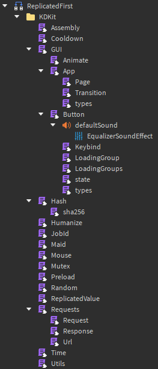

# KDKit

A collection of tools that Khronos Development uses in every game.

## Usage

First, [install](#installation) KDKit. Then, you can require all the tools:

```lua
local KDKit = require(game:GetService("ReplicatedStorage").KDKit)

KDKit.Utils
    .try(function()
        local response = KDKit.Requests.get("https://catfact.ninja/fact")
        return response:json()["fact"]
    end)
    :catch(function(traceback)
        print("Failed to fetch a cat fact, got an error:", traceback)
    end)
    :proceed(function(fact)
        print("Did you know:", fact)
    end)
```

Or, you can require individual tools:

```lua
local KDKit = game:GetService("ReplicatedStorage").KDKit
local Humanize = require(KDKit.Humanize)

for _, word in {"item", "knife", "Option", "LIST"} do
    print(('The plural of "%s" is "%s"'):format(word, Humanize.plural(word)))
end
```

## Features

KDKit is comprised of mostly-separable unique modules. Each module contains its own documentation (some better than others). A brief summary of each module is provided here:

| Module                                             | Description                                                                                                                                        |
| -------------------------------------------------- | -------------------------------------------------------------------------------------------------------------------------------------------------- |
| [KDKit.Assembly](KDKit/Assembly.lua)               | Manages the network owner of a physics object (aka an assembly).                                                                                   |
| [KDKit.Cryptography](KDKit/Cryptography/init.lua)  | Implements hashing and encoding functions.                                                                                                         |
| [KDKit.GUI](KDKit/GUI/README.md)                   | A complete GUI framework focused on automatically handling animations.                                                                             |
| [KDKit.Humanize](KDKit/Humanize.lua)               | Several utilities for working with the English language and numbers.                                                                               |
| [KDKit.Maid](KDKit/Maid.lua)                       | Keeps tracks of "tasks" that need to eventually be cleaned up. It's a ripoff [Nevermore/Maid](https://quenty.github.io/NevermoreEngine/api/Maid/). |
| [KDKit.Mouse](KDKit/Mouse.lua)                     | Simplifies tasks involving the mouse, especially managing the icon.                                                                                |
| [KDKit.Mutex](KDKit/Mutex.lua)                     | A [mutex lock](<https://en.wikipedia.org/wiki/Lock_(computer_science)>) implementation.                                                            |
| [KDKit.Preload](KDKit/Preload.lua)                 | Various utilities to help "wait for xyz".                                                                                                          |
| [KDKit.Random](KDKit/Random.lua)                   | Wrapper around global `Random` with additional functionality.                                                                                      |
| [KDKit.ReplicatedValue](KDKit/ReplicatedValue.lua) | Allows arbitrary data to replicated between the server and subscribing clients.                                                                    |
| [KDKit.Requests](KDKit/Requests.lua)               | Simplifies the process of making HTTP requests. API inspired by Python's [`requests`](https://github.com/psf/requests).                            |
| [KDKit.Time](KDKit/Time.lua)                       | Synchronized UTC time, since `os.time()` is woefully unreliable.                                                                                   |
| [KDKit.Utils](KDKit/Utils.lua)                     | Expansive collection of many utility functions, such as: `min`, `max`, `sum`, `median`, `any` etc.                                                 |

## Installation

### Manual

<details>
    <summary>Copy and paste code into Roblox.</summary>
  
If you know what you want, and don't care about versioning, you can simply copy and paste whatever you want into the game.

This is what a full KDKit installation looks like in-game:



Many of the features do not rely on each other, so you may choose to only add one or a few modules.

</details>

### Rojo

<details>
    <summary>Add KDKit as a git submodule.</summary>
  
Lets say you have the following [Rojo](https://rojo.space/) project for your game:
```
YourGame/
├── src/
│   ├── ReplicatedStorage/
│   │   └── YourReplicatedCode.lua
│   └── ServerScriptService/
│       └── YourServerCode.lua
└── default.project.json
```

Where `default.project.json` is:

```json
{
  "name": "YourGame",
  "tree": {
    "$className": "DataModel",
    "ServerScriptService": {
      "$ignoreUnknownInstances": true,
      "$path": "src/ServerScriptService"
    },
    "ReplicatedStorage": {
      "$ignoreUnknownInstances": true,
      "$path": "src/ReplicatedStorage"
    }
  }
}
```

And you want to install `KDKit` to `ReplicatedStorage/KDKit`. You can add it as a submodule:

```sh
cd YourGame/src/ReplicatedStorage
git submodule add "https://github.com/KhronosDevelopment/KDKit" KDKit
```

And you're done! Now you can use KDKit:

```lua
local KDKit = require(game:GetService("ReplicatedStorage"):WaitForChild("KDKit"))

print(KDKit.Utils.sum({ 1, 2, 3 }))
```

</details>

> [!NOTE]
> This repository does not use [Wally](https://wally.run/) due to [incompatibilities](https://discord.com/channels/385151591524597761/872225914149302333/1257773007577809027).
